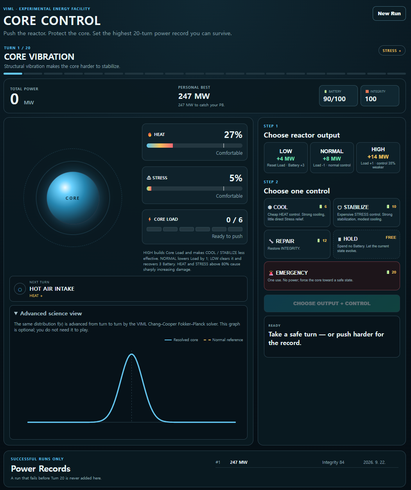

# Core Control v1.0

A short **score-attack reactor-control game** powered by a persistent 1-D **Fokker–Planck solver**.

You operate one experimental energy core for **20 turns**. Each turn you choose an output level and one control action. Higher output generates more Power, but it also pushes the same evolving distribution function toward dangerous states. If the core fails before Turn 20, the run is invalid and **no record is saved**.

> **Goal:** survive all 20 turns and produce the highest Power record you can safely bank.

## Screenshot

<p align="center">
  
</p>

<p align="center">
  <em>Gameplay screenshot of Core Control v1.0.</em>
</p>

## What makes this version different?

Unlike a purely arcade-style management toy, **Core Control** keeps one physical state alive through the full run:

$$
f_0(v) \rightarrow f_1(v) \rightarrow \cdots \rightarrow f_{20}(v).
$$

The distribution is **not reinitialized each turn**. Your actions influence the same persistent system across all 20 turns, which is why greedy play can backfire later.

The runtime evolves

$$\frac{\partial f}{\partial t}=\frac{\partial}{\partial v}\left[D(v)\frac{\partial f}{\partial v}\right]+\nu_{\rm coll}\left(f_{\rm eq}-f\right),$$

with

$$
D(v)=D_0\left(1+0.1v^2\right),
$$

using the conservative **Chang–Cooper** solver included in the repository.

HEAT is derived mainly from the evolving distribution width, while STRESS depends on high-energy-tail / shape information plus persistent operational stress from reactor operation.

## Core gameplay loop

Every turn:

1. Choose reactor output: **LOW / NORMAL / HIGH**.
2. Choose one control: **COOL / STABILIZE / REPAIR / HOLD / EMERGENCY**.
3. Advance the current distribution `f(v)` with the built-in Fokker–Planck solver.
4. Update **HEAT, STRESS, Integrity, Battery, Core Load, and generated Power**.
5. Reach Turn 20 alive to make the run official.

A failed run is **never added to the record table**, even if it generated more Power than your personal best.

## Controls

| Control | Battery cost | Main purpose |
|---|---:|---|
| ❄ **COOL** | 6 | Cheap, efficient HEAT control |
| 🛡 **STABILIZE** | 10 | Strong STRESS / distribution stabilization |
| 🔧 **REPAIR** | 12 | Restore Integrity |
| ⏸ **HOLD** | 0 | Save Battery and accept natural evolution |
| 🚨 **EMERGENCY** | 20 | One-use emergency safety response |

### Control philosophy

- **COOL** strongly suppresses diffusion and pushes the core toward a cooler state, but offers little direct operational-stress relief.
- **STABILIZE** strongly increases relaxation and reduces operational STRESS, but is intentionally less efficient as a pure cooling tool.
- **REPAIR** is your survival button when Integrity is slipping.
- **HOLD** is important for pacing, Battery recovery planning, and risk management.
- **EMERGENCY** is an expensive one-use panic option.

## Output modes and Core Load

| Output | Reward / effect |
|---|---|
| **LOW** | +4 MW, resets Core Load, recovers 3 Battery, controls work at 125% strength |
| **NORMAL** | +8 MW, lowers Core Load by 1, controls work at normal strength |
| **HIGH** | +14 MW, raises Core Load by 1, controls work at only 65% strength |

Repeated **HIGH** output also strengthens diffusion and weakens relaxation. It is intentionally strong for scoring, but unsafe when spammed blindly.

## Included systems in v1.0

- persistent 20-turn Fokker–Planck evolution;
- nonlinear damage above the HEAT / STRESS red zone;
- random operating events and crisis turns;
- next-turn forecast;
- upgrade choices at Turns 5, 10, and 15;
- one-use EMERGENCY action;
- Advanced Science View showing the live `f(v)` evolution;
- local successful-run leaderboard;
- failed runs do not count.

## Run locally

```bash
pip install -r requirements.txt
python -m uvicorn app:app --reload
```

Then open:

```text
http://127.0.0.1:8000
```

Windows users can run `run.bat`; Linux/macOS users can use `./run.sh`.

## Repository structure

```text
core-control-v1.0/
├── app.py
├── game_engine.py
├── physics_engine.py
├── fp_solver_v1.py
├── test_v10_smoke.py
├── static/
│   ├── index.html
│   ├── app.js
│   └── style.css
├── assets/
│   └── core-control-v1.0-ui.png
├── VERSION
├── CHANGELOG.md
├── README.md
├── LICENSE
├── requirements.txt
├── run.bat
└── run.sh
```

## License

Distributed under the **VIML Research and Non-Commercial License, Version 1.0 (2026)** included in `LICENSE`.
